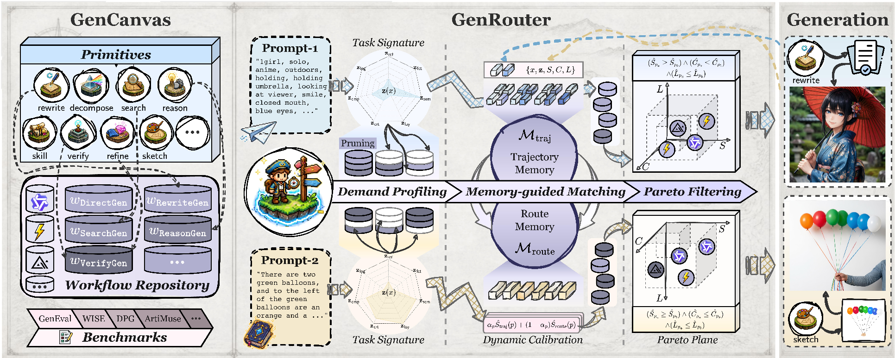

<h2 align="center"> GenRouter: Unified Workflow Routing for Agentic Image Generation</h2>
<div align="center">

_**[Harold H. Chen](https://haroldchen19.github.io/)<sup>1,2*</sup>, [Zhiyu Hou](https://github.com/KevinHuge)<sup>1,3*</sup>,<br>[Wen-Jie Shu](https://wenjieshu.github.io/)<sup>4</sup>, [Weilin Ruan](https://rwlinno.github.io/)<sup>5</sup>, [Yingjie Xu](https://scholar.google.com/citations?user=TyoprpUAAAAJ&hl)<sup>1</sup>, [Litao Guo](https://scholar.google.com/citations?user=efdm760AAAAJ&hl)<sup>1</sup>, [Ying-Cong Chen](https://www.yingcong.me/)<sup>1,2†</sup>**_
<br><br>
<sup>*</sup>Equal Contribution; <sup>†</sup>Corresponding Author
<br>
<sup>1</sup>HKUST(GZ), <sup>2</sup>HKUST, <sup>3</sup>SUSTech, <sup>4</sup>ZODA, <sup>5</sup>CUHK

<h5 align="center"> If you like our project, please give us a star ⭐ on GitHub for latest update.  </h2>

 <a href='https://arxiv.org/abs/2602.02227'></a>
<br>

</div>


</div>

---
## 💡 Overview


<div align="center">

<br>
</div>

While agentic image generation has achieved remarkable capabilities, existing systems often suffer from fragmentation and a "one-size-fits-all" compute-mismatch that squanders computational resources. To bridge this gap, we introduce a unified framework consisting of two core components:

*   **GenCanvas:** The first unified workflow space that standardizes the execution paradigm of agentic image generation. It systematically deconstructs the generative process into universal foundational primitives (*e.g.*, search, reason, verify, and sketch) and establishes a scalable library of workflow templates.
*   **GenRouter:** A dynamic, self-evolving workflow router driven by demand profiling, memory-guided utility matching, and Pareto filtering. It seamlessly pairs diverse heterogeneous prompts with optimal execution plans to balance visual performance and computational cost.

<div align="center">

<br>
</div>


By adaptively routing each prompt to its optimal agentic configuration, our framework effectively handles highly intricate requests, such as multi-step spatial reasoning and precise text rendering, without the prohibitive latency of heavy static pipelines. 


## 🗒️ Layout

```text
.
|-- src/genrouter/       # Routing, workflows, backends, memory, and logging
|-- configs/            # Runtime, generator, workflow, and evaluation configs
|-- scripts/services/   # Local image and language model services
|-- eval/               # Shared benchmark runner and official adapters
|-- data/               # Ignored run artifacts; only .gitkeep is tracked
`-- models/             # Ignored local checkpoints; only .gitkeep is tracked
```

## 🚀 Installation

```bash
conda env create --file environment.yml
conda activate genrouter
```

OneIG and WISE use additional isolated environments documented in their
benchmark setup guides.

## 📟 Model Setup

Download the shared local models to the paths expected by
`scripts/services/` and `scripts/serve.sh`:

```bash
hf download Tongyi-MAI/Z-Image-Turbo \
  --local-dir models/Z-Image-Turbo
hf download Qwen/Qwen-Image-2512 \
  --local-dir models/Qwen-Image-2512
hf download Qwen/Qwen-Image-Edit-2511 \
  --local-dir models/Qwen-Image-Edit-2511
hf download Qwen/Qwen3.5-4B \
  --local-dir models/Qwen3.5-4B
hf download Qwen/Qwen3.5-35B-A3B \
  --local-dir models/Qwen3.5-35B-A3B
```

| Service | Model directory | Port |
| --- | --- | ---: |
| Z-Image generator | `models/Z-Image-Turbo` | `8010` |
| Qwen Image generator | `models/Qwen-Image-2512` | `8009` |
| Qwen Image Edit generator | `models/Qwen-Image-Edit-2511` | `8008` |
| Task-signature model | `models/Qwen3.5-4B` | `8011` |
| WISE judge | `models/Qwen3.5-35B-A3B` | `8000` |

Evaluator-specific checkpoints are listed in each benchmark README; they are
not downloaded by `eval/run.py` unless the upstream evaluator explicitly uses
an online model cache.

## 🌏 Configuration

For remote backends, create the ignored API configuration and fill only the
profiles you use:

```bash
cp configs/api_config.example.yaml configs/api_config.yaml
```

Credentials may also be supplied through `DASHSCOPE_API_KEY`,
`MODELSCOPE_API_KEY`, and `SERPER_API_KEY`. Generator capabilities and defaults
are defined in `configs/generators.yaml`; the routing pool is defined in
`configs/default.yaml`.

## 📍 Quick Start

List registered workflows, generators, and skills:

```bash
PYTHONPATH=src python run.py --list all
```

Run one explicit workflow-generator plan:

```bash
PYTHONPATH=src python run.py \
  --prompt 'A red cube on a table' \
  --workflow DirectGen \
  --generator qwen_image \
  --prompt-id demo \
  --output-dir data/runs
```

Omit `--workflow` and `--generator` to route from accumulated experience and
route memory.

## 📊 Benchmarks

Every benchmark uses the same entry point. Its setup guide owns the pinned
official checkout, evaluator model, cache, and environment contract.

| Benchmark | Setup | Run |
| --- | --- | --- |
| DPG-Bench | [guide](eval/dpg_bench/README.md) | `PYTHONPATH=src python eval/run.py --config configs/eval/dpg_bench.yaml` |
| OneIG | [guide](eval/oneig/README.md) | `PYTHONPATH=src python eval/run.py --config configs/eval/oneig.yaml` |
| WISE | [guide](eval/wise/README.md) | `PYTHONPATH=src python eval/run.py --config configs/eval/wise.yaml` |
| LongText-Bench | [guide](eval/textbench/README.md) | `PYTHONPATH=src python eval/run.py --config configs/eval/textbench.yaml` |
| GenEval2 | [guide](eval/geneval2/README.md) | `PYTHONPATH=src python eval/run.py --config configs/eval/geneval2.yaml` |
| ArtiMuse | [guide](eval/artimuse/README.md) | `PYTHONPATH=src python eval/run.py --config configs/eval/artimuse.yaml` |
| SpatialGenEval | [guide](eval/spatialgeneval/README.md) | `PYTHONPATH=src python eval/run.py --config configs/eval/spatialgeneval.yaml` |


## 🌠 Output Layout

Manual runs write one directory per prompt:

```text
data/runs/<prompt-id>/
|-- result.json
`-- trace.jsonl
```

Benchmark runs keep protocol state, scores, memory, and generated images under:

```text
data/benchmarks/<benchmark>/<run-id>/
|-- manifest.json
|-- cold_start/
|-- batches/
|-- records.jsonl
|-- scores.jsonl
|-- experience.jsonl
|-- route_memory.jsonl
|-- summary.json
`-- images/
```

The manifest advances only after a complete phase or batch succeeds.

## 📝 Citation

Please consider citing our paper if you find GenCanvas & GenRouter are useful:
```bib
@article{chen2026genrouter,
  title={GenRouter: Unified Workflow Routing for Agentic Image Generation},
  author={Chen, Harold Haodong and Hou, Zhiyu and Shu, Wen-Jie and Ruan, Weilin and Xu, Yingjie and Guo, Litao and Chen, Ying-Cong},
  journal={arXiv preprint arXiv:TBD},
  year={2026}
}
```

## 🔰 License and Third-Party Benchmarks

This repository does not currently contain a license file, so no project
license is asserted here. Official benchmark repositories, datasets,
evaluator models, and weights retain their own licenses and are not
redistributed by this repository.

## 📪 Contact
For any question, feel free to open an issue or email `haroldchen328@gmail.com`.
